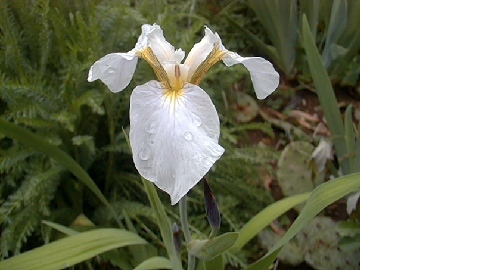

## Iris

Let me introduce myself. My name is Iris Setosa.





---

## Meet her family.

```{r}

summary(iris)
```

---

## Do you recognize her family?

```{r}
result=kmeans(iris[,-5],3)
table( iris$Species, result$cluster)
```

---

## How do you related to her?


```{r}
plot(iris[c("Sepal.Length", "Sepal.Width")], col = result$cluster)
points(result$centers[,c("Sepal.Length", "Sepal.Width")], col = 1:3, pch = 8, cex=2)

```
