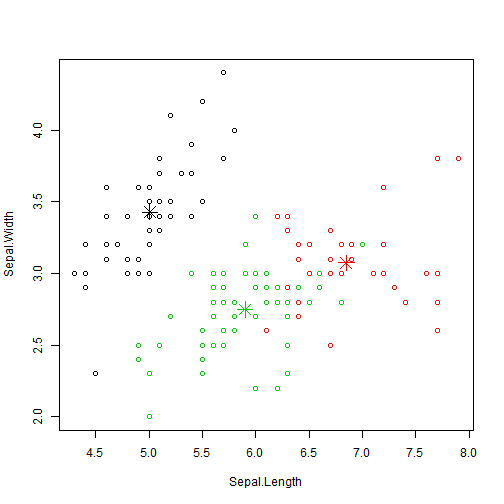

## Iris

Let me introduce myself. My name is Iris Setosa.


---

## Meet her family.


```r
summary(iris)
```

```
##   Sepal.Length   Sepal.Width    Petal.Length   Petal.Width 
##  Min.   :4.30   Min.   :2.00   Min.   :1.00   Min.   :0.1  
##  1st Qu.:5.10   1st Qu.:2.80   1st Qu.:1.60   1st Qu.:0.3  
##  Median :5.80   Median :3.00   Median :4.35   Median :1.3  
##  Mean   :5.84   Mean   :3.06   Mean   :3.76   Mean   :1.2  
##  3rd Qu.:6.40   3rd Qu.:3.30   3rd Qu.:5.10   3rd Qu.:1.8  
##  Max.   :7.90   Max.   :4.40   Max.   :6.90   Max.   :2.5  
##        Species  
##  setosa    :50  
##  versicolor:50  
##  virginica :50  
##                 
##                 
## 
```

---

## Do you recognize her family?


```r
result=kmeans(iris[,-5],3)
table( iris$Species, result$cluster)
```

```
##             
##               1  2  3
##   setosa     50  0  0
##   versicolor  0  2 48
##   virginica   0 36 14
```

---

## How do you related to her?


```r
plot(iris[c("Sepal.Length", "Sepal.Width")], col = result$cluster)
points(result$centers[,c("Sepal.Length", "Sepal.Width")], col = 1:3, pch = 8, cex=2)
```

 
